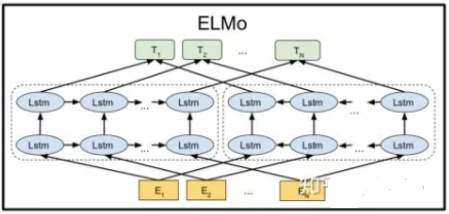

# 【关于 Elmo】 那些你不知道的事

> 作者：杨夕
> 
> 【注：手机阅读可能图片打不开！！！】

## 一、Elmo 动机篇

### 1.1 为什么会有 Elmo？

- 多义词问题：
  - 因为 one-hot、word2vec、fastText 为静态方式，即训练好后，每个词表达固定；
- 单向性：
  - 因为 one-hot、word2vec、fastText 都是 从左向右 学习，导致该方法 不能 同时考虑 两边信息；

## 二、Elmo 介绍篇

### 2.1 Elmo 的 特点？

基于特征融合 的 word emb

### 2.2 Elmo 的 思想是什么？

- 预训练时，使用语言模型学习一个单词的emb（**多义词无法解决**）；
- 使用时，单词间具有特定上下文，可根据上下文单词语义调整单词的emb表示（**可解决多义词问题**）
  - 理解：因为预训练过程中，emlo 中 的 lstm 能够学习到 每个词 对应的 上下文信息，并保存在网络中，在 fine-turning 时，下游任务 能够对 该 网络进行 fine-turning，使其 学习到新特征； 

## 三、Elmo 问题篇

### 3.1 Elmo 存在的问题是什么？

1. 在做序列编码任务时，使用 LSTM；
2. ELMo 采用双向拼接的融合特征，比Bert一体化融合特征方式弱；

## 参考资料

1. [神经网路语言模型(NNLM)的理解](https://blog.csdn.net/lilong117194/article/details/82018008)
3. [NLP 面试题（一）和答案，附有参考URL](https://www.jianshu.com/p/fbb6d5e75059)