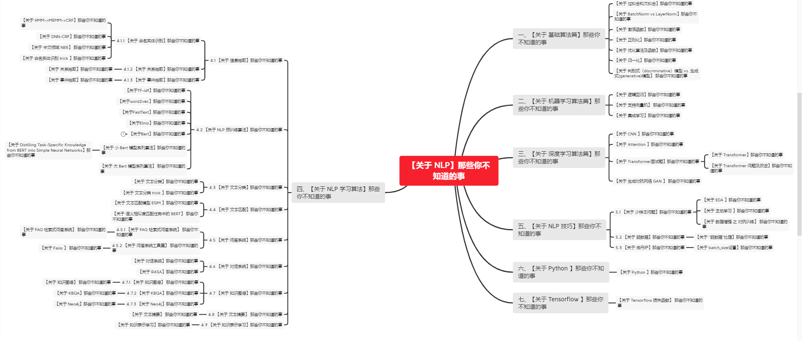

# 【关于 NLP】那些你不知道的事 

> 作者：杨夕、芙蕖、李玲、陈海顺、twilight、LeoLRH、杜晓东、艾春辉、张永泰、金金金

## 介绍

本项目是作者们根据个人面试和经验总结出的自然语言处理(NLP)面试准备的学习笔记与资料，该资料目前包含 自然语言处理各领域的 面试题积累。

## 目录架构

### 一、[【关于 基础算法篇】那些你不知道的事](BasicAlgorithm/)

- [【关于 过拟合和欠拟合】那些你不知道的事](BasicAlgorithm/过拟合和欠拟合.md)
  - 一、过拟合和欠拟合 是什么？
  - 二、过拟合/高方差（overfiting / high variance）篇
    - 2.1 过拟合是什么及检验方法？
    - 2.2 导致过拟合的原因是什么？
    - 2.3 过拟合的解决方法是什么？
  - 三、欠拟合/高偏差（underfiting / high bias）篇
    - 3.1 欠拟合是什么及检验方法？
    - 3.2 导致欠拟合的原因是什么？
    - 3.3 过拟合的解决方法是什么？
- [【关于 BatchNorm vs LayerNorm】那些你不知道的事](BasicAlgorithm/BatchNormVsLayerNorm.md)
  - 一、动机篇
    - 1.1 独立同分布（independent and identically distributed）与白化
    - 1.2 （ Internal Covariate Shift，ICS）
    - 1.3 ICS问题带来的后果是什么？
  - 二、Normalization 篇
    - 2.1 Normalization 的通用框架与基本思想
  - 三、Batch Normalization 篇
    - 3.1 Batch Normalization（纵向规范化）是什么？
    - 3.2 Batch Normalization（纵向规范化）存在什么问题？
    - 3.3 Batch Normalization（纵向规范化）适用的场景是什么？
    - 3.4 BatchNorm 存在什么问题？
  - 四、Layer Normalization（横向规范化） 篇
    - 4.1 Layer Normalization（横向规范化）是什么？
    - 4.2 Layer Normalization（横向规范化）有什么用？
  - 五、BN vs LN 篇
  - 六、主流 Normalization 方法为什么有效？
- [【关于 激活函数】那些你不知道的事](BasicAlgorithm/激活函数.md)
  - 一、动机篇
    - 1.1 为什么要有激活函数？
  - 二、激活函数介绍篇
    - 2.1 sigmoid 函数篇
      - 2.1.1 什么是 sigmoid 函数？
      - 2.1.2 为什么选 sigmoid 函数 作为激活函数？
      - 2.1.3 sigmoid 函数 有什么缺点？
    - 2.2 tanh 函数篇
      - 2.2.1 什么是 tanh 函数？
      - 2.2.2 为什么选 tanh 函数 作为激活函数？
      - 2.2.3 tanh 函数 有什么缺点？
    - 2.3 relu 函数篇
      - 2.3.1 什么是 relu 函数？
      - 2.3.2 为什么选 relu 函数 作为激活函数？
      - 2.3.3 relu 函数 有什么缺点？
  - 三、激活函数选择篇
- [【关于 正则化】那些你不知道的事](BasicAlgorithm/正则化.md)
  - [一、L0，L1，L2正则化 篇](BasicAlgorithm/正则化.md#一l0l1l2正则化-篇)
    - [1.1 正则化 是什么？](BasicAlgorithm/正则化.md#11-正则化-是什么)
    - [1.2 什么是 L0 正则化 ？](BasicAlgorithm/正则化.md#12-什么是-l0-正则化-)
    - [1.3 什么是 L1 （稀疏规则算子 Lasso regularization）正则化 ？](BasicAlgorithm/正则化.md#13-什么是-l1-稀疏规则算子-lasso-regularization正则化-)
    - [1.4 什么是 L2 正则化（岭回归 Ridge Regression 或者 权重衰减 Weight Decay）正则化 ？](BasicAlgorithm/正则化.md#14-什么是-l2-正则化岭回归-ridge-regression-或者-权重衰减-weight-decay正则化-)
  - [二、对比篇](BasicAlgorithm/正则化.md#二对比篇)
    - [2.1 什么是结构风险最小化？](BasicAlgorithm/正则化.md#21-什么是结构风险最小化)
    - [2.2 从结构风险最小化的角度理解L1和L2正则化](BasicAlgorithm/正则化.md#22-从结构风险最小化的角度理解l1和l2正则化)
    - [2.3 L1 vs L2](BasicAlgorithm/正则化.md#23-l1-vs-l2)
  - [三、dropout 篇](BasicAlgorithm/正则化.md#三dropout-篇)
    - [3.1 什么是 dropout？](BasicAlgorithm/正则化.md#31-什么是-dropout)
    - [3.2 dropout 在训练和测试过程中如何操作？](BasicAlgorithm/正则化.md#32-dropout-在训练和测试过程中如何操作)
    - [3.3 dropout 如何防止过拟合?](BasicAlgorithm/正则化.md#33-dropout-如何防止过拟合)
- [【关于 优化算法及函数】那些你不知道的事](BasicAlgorithm/优化算法及函数.md)
- [【关于 归一化】那些你不知道的事](BasicAlgorithm/归一化.md)
- [【关于 判别式（discriminative）模型 vs. 生成式(generative)模型】 那些你不知道的事](BasicAlgorithm/判别式vs生成式.md)

### 二、[【关于 机器学习算法篇】那些你不知道的事](MachineLearningAlgorithm)

- [【关于 逻辑回归】那些你不知道的事](MachineLearningAlgorithm/逻辑回归.md)
- [【关于 支持向量机】 那些你不知道的事](MachineLearningAlgorithm/支持向量机.md)
- [【关于 集成学习】那些你不知道的事](MachineLearningAlgorithm/集成学习.md)

### 三、[【关于 深度学习算法篇】那些你不知道的事](DeepLearningAlgorithm)
  
- [【关于 CNN 】那些你不知道的事](DeepLearningAlgorithm/cnn/)
- [【关于 Attention 】那些你不知道的事](DeepLearningAlgorithm/attention)
- [【关于 Transformer面试题】那些你不知道的事](DeepLearningAlgorithm/transformer)
  - [【关于 Transformer】那些你不知道的事](DeepLearningAlgorithm/transformer/readme.md) 
  - [【关于 Transformer 问题及改进】那些你不知道的事](DeepLearningAlgorithm/transformer/transformer_error.md) 
- [【关于 生成对抗网络 GAN 】 那些你不知道的事](DeepLearningAlgorithm/adversarial_training_study/readme.md)

### 四、[【关于 NLP 学习算法】那些你不知道的事](NLPinterview)

#### 4.1 [【关于 信息抽取】那些你不知道的事](NLPinterview/NER/)

##### 4.1.1 [【关于 命名实体识别】那些你不知道的事](NLPinterview/NER/)

- [【关于 HMM->MEMM->CRF】那些你不知道的事](NLPinterview/ner/crf/)
- [【关于 DNN-CRF】那些你不知道的事](NLPinterview/ner/DNN/readme.md)
- [【关于 中文领域 NER】 那些你不知道的事](NLPinterview/ner/ChineseNer/readme.md)
- [【关于 命名实体识别 trick 】那些你不知道的事](NLPinterview/ner/NERtrick/NERtrick.md)

##### 4.1.2 [【关于 关系抽取】那些你不知道的事](NLPinterview/RelationExtraction/)

- [【关于 关系抽取】那些你不知道的事](NLPinterview/RelationExtraction/)

##### 4.1.3 [【关于 事件抽取】那些你不知道的事](NLPinterview/EventExtraction/)

- [【关于 事件抽取】那些你不知道的事](NLPinterview/EventExtraction/)
 
#### 4.2 [【关于 NLP 预训练算法】那些你不知道的事](NLPinterview/PreTraining/)

- [【关于TF-idf】那些你不知道的事](NLPinterview/PreTraining/tfidf)
- [【关于word2vec】那些你不知道的事](NLPinterview/PreTraining/word2vec)
- [【关于FastText】那些你不知道的事](NLPinterview/PreTraining/fasttext)
- [【关于Elmo】那些你不知道的事](NLPinterview/PreTraining/elmo)
- [【关于Bert】那些你不知道的事](NLPinterview/PreTraining/bert)
  - [【关于Bert】那些你不知道的事](NLPinterview/PreTraining/bert/readme.md) 
  - [【关于 Bert 源码解析 之 总览大局篇】那些你不知道的事](NLPinterview/PreTraining/bert/bertCode.md)
  - [【关于 Bert 源码解析I 之 主体篇】那些你不知道的事](NLPinterview/PreTraining/bert/bertCode1_modeling.md)
  - [【关于 Bert 源码解析II 之 预训练篇】那些你不知道的事](NLPinterview/PreTraining/bert/bertCode2_pretraining.md)
  - [【关于 Bert 源码解析III 之 微调篇】那些你不知道的事](NLPinterview/PreTraining/bert/bertCode3_fineTune.md)
  - [【关于 Bert 源码解析IV 之 句向量生成篇】那些你不知道的事](NLPinterview/PreTraining/bert/bertCode4_word2embedding.md)
  - [【关于 Bert 源码解析V 之 文本相似度篇】那些你不知道的事](NLPinterview/PreTraining/bert/bertCode5_similarity.md)
- [【关于 小 Bert 模型系列算法】那些你不知道的事](NLPinterview/PreTraining/bert_zip)
  - [【关于 Distilling Task-Specific Knowledge from BERT into Simple Neural Networks】那些你不知道的事](NLPinterview/PreTraining/bert_zip/BERTintoSimpleNeuralNetworks/)
- [【关于 大 Bert 模型系列算法】 那些你不知道的事](NLPinterview/PreTraining/bert_big)

#### 4.3 [【关于 文本分类】那些你不知道的事](NLPinterview//textclassifier/)

- [【关于 文本分类】那些你不知道的事](NLPinterview//textclassifier/TextClassification/)
- [【关于 文本分类 trick 】那些你不知道的事](NLPinterview//textclassifier/ClassifierTrick/)

#### 4.4 [【关于 文本匹配】那些你不知道的事](NLPinterview/TextMatch/)

- [【关于 文本匹配模型 ESIM 】那些你不知道的事](NLPinterview/TextMatch/ESIM/)
- [【关于 语义相似度匹配任务中的 BERT】 那些你不知道的事](NLPinterview/TextMatch/bert_similairity/)

#### 4.5 [【关于 问答系统】那些你不知道的事](NLPinterview/QA/)

##### 4.5.1 [【关于 FAQ 检索式问答系统】 那些你不知道的事](NLPinterview/QA/FAQ/)

- [【关于 FAQ 检索式问答系统】 那些你不知道的事](NLPinterview/QA/FAQ/)

##### 4.5.2 [【关于 问答系统工具篇】 那些你不知道的事](NLPinterview/QA/Faiss/)

- [【关于 Faiss 】 那些你不知道的事](NLPinterview/QA/Faiss/)

#### 4.6 [【关于 对话系统】那些你不知道的事](NLPinterview/DialogueSystem/)

- [【关于 对话系统】那些你不知道的事](NLPinterview/DialogueSystem/)
- [【关于 RASA】那些你不知道的事](NLPinterview/DialogueSystem/Rasa/)

#### 4.7 [【关于 知识图谱】那些你不知道的事](NLPinterview/KG/)

##### 4.7.1 [【关于 知识图谱】 那些你不知道的事](NLPinterview/KG/)

- [【关于 知识图谱】 那些你不知道的事](NLPinterview/KG/)

##### 4.7.2 [【关于 KBQA】那些你不知道的事](NLPinterview/KG/KBQA/)

- [【关于 KBQA】那些你不知道的事](NLPinterview/KG/KBQA/)

##### 4.7.3 [【关于 Neo4j】那些你不知道的事](NLPinterview/KG/neo4j/)

- [【关于 Neo4j】那些你不知道的事](NLPinterview/KG/neo4j/)

#### 4.8 [【关于 文本摘要】 那些你不知道的事](NLPinterview/summary/)

- [【关于 文本摘要】 那些你不知道的事](NLPinterview/summary/)

#### 4.9 [【关于 知识表示学习】那些你不知道的事](NLPinterview/KnowledgeRepresentation/)

- [【关于 知识表示学习】那些你不知道的事](NLPinterview/KnowledgeRepresentation/)

 
### 五、[【关于 NLP 技巧】那些你不知道的事](Trick)

#### 5.1 [【关于 少样本问题】那些你不知道的事](Trick/SmallSampleProblem/)

- [【关于 EDA 】那些你不知道的事](Trick/SmallSampleProblem/EDA/eda.md)
- [【关于 主动学习 】那些你不知道的事](Trick/SmallSampleProblem/activeLearn/readme.md)
- [【关于 数据增强 之 对抗训练】 那些你不知道的事](Trick/SmallSampleProblem/AdversarialTraining/AdversarialTraining.md)

#### 5.2 [【关于 脏数据】那些你不知道的事](Trick/noisy_label_learning/)

- [【关于 “脏数据”处理】那些你不知道的事](Trick/noisy_label_learning/)

#### 5.3 [【关于 炼丹炉】那些你不知道的事](Trick/)

- [【关于 batch_size设置】那些你不知道的事](Trick/batch_size/)

### 六、[【关于 Python 】那些你不知道的事](python/)

- [【关于 Python 】那些你不知道的事](python/)

### 七、[【关于 Tensorflow 】那些你不知道的事](Tensorflow/)

- [【关于 Tensorflow 损失函数】 那些你不知道的事](Tensorflow/loss_study/)