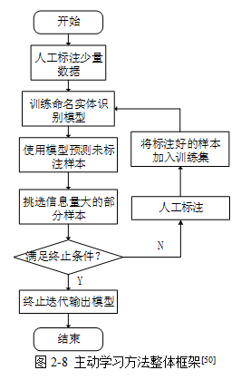

# 【关于 主动学习】 那些你不知道的事

> 作者：杨夕
> 
> 本文链接：https://github.com/km1994/nlp_paper_study
> 
> 个人介绍：大佬们好，我叫杨夕，该项目主要是本人在研读顶会论文和复现经典论文过程中，所见、所思、所想、所闻，可能存在一些理解错误，希望大佬们多多指正。
> 
> 【注：手机阅读可能图片打不开！！！】

## 一、动机篇

### 1.1 主动学习是什么？

- 类型：机器学习算法
- 思路：
  - 通过主动找到最有价值的训练样本加入训练集，如果该样本是未标记的，则会自动要求人工标注，然后再用于模型训练；
- 目标：以更少的训练样本训练出性能尽可能高的模型；

### 1.2 为什么需要主动学习？

- 数据标注成本高，尤其是专业知识领域；
- 数据量巨大，难以全量训练 ，或训练机器/时间有限；

## 二、主动学习篇

### 2.1 主动学习的思路是什么？

该方法首先筛选出条的未标记样本，然后对其手动标记，然后采用该标记过的数据训练实体识别模型，接着，用训练后的模型标记未标记数据；最后，利用主动学习的样本抽取策略计算未标记样本的价值量后排序，挑拣条价值含量最高的未标记数据，手工标记后合并标记样本，并作为新的训练集。循环实行以上步骤，当被检测指标满足预设范围后停止循环。

### 2.2 主动学习方法 的价值点在哪里？

- 主动学习能减少样本标注量来节约成本，包括标注成本和训练资源成本；并且主动学习能在同等数据量下提升模型性能。

> 未标注的样本池有1000w个样本，应用主动学习从中挑出200w样本进行标注后训练，便能训练出性能与1000w训练相当的模型。通常认为，主动学习能减少一半以上的样本标注量。有时主动学习挑选数据集子集进行训练，模型性能能超越全量训练。

## 三、样本选取策略篇

### 3.1 以未标记样本的获取方式的差别进行划分

- 成员查询的样本选取策略主要是从未标记样本中选取出能有效提升训练模型实体识别效果的样本，并对其进行手工标记，虽然该方法操作起来比较方便，但是容易挑选出比较多的无价值样本。
- 基于流的样本选取策略将未标记样本排列成一个队列，而后每一时刻对当前队头样本标记。
- 基于池的样本选取策略从未标记样本集中选取一部分样本置于待标记样本池中，方便后期抽取。

### 3.2 测试集内选取“信息”量最大的数据标记

#### 3.2.1 测试集内选取“信息”量最大的数据标记

- 依赖委员会的样本选取策略（Query by committee, QBC）：首先利用当前已标记样本集训练得到多个NER模型组建委员会；然后委员会成员分别根据自己的经验判断未标记样本中每个词可能属于的类型；而后统计样本中每个词的不同类型选项所获得的成员票数；最后，抽取出所获得的选票最不统一的样本标记。如果未标记样本带有信息量较高时，容易误导委员会中不同成员对其的判断，使其做出不正确的反应，NER模型通过这些标记好的信息量最多的样本，能够为当前NER模型带来较大的泛化能力提升。
- 依赖不确定度的样本选取策略（Uncertainty Sampling, US）：利用信息熵方法评估标记样本的不稳定性。该方法首先通过已标记样本集对实体识别模型进行训练，然后利用该模型计算样本中每个字符隶属于不同实体类型的概率，最后，标记不稳定性高的数据，通过利用这些不稳定性高的数据训练实体识别模型，能够提高模型预能力。
- 依赖代表性大的样本选取策略（Representative Sampling, RS）：首先计算未标记样本中不同样本的向量化表示，然后，采用聚类分析使样本聚类成多个簇，最后从聚类所得到的不同簇中挑出离中心点最近的样本进行标记。一般而言，未标记样本集中某些样本具有一些相同的特征，聚类分析方法能够根据这些特征，将其划分到不同的簇中。离该簇中心点越近的样本点，具有能够很好的代表该样本所在簇的其他样本，所以对该样本点进行学习，能提高NER模型对该簇中其他未标记样本的实体识别能力。

#### 3.2.2 依赖不确定度的样本选取策略（Uncertainty Sampling, US）

- 思想：不确定性越大，蕴含信息量越大，越有训练价值；
- 流程：
1. 用已打标的数据子集训练模型，用该模型预测剩余未打标样本；
2. 根据预测结果使用不确定性衡量标准找出最不确定的样本；
3. 交给打标人员标注；
4. 加入训练集训练模型，再用该模型进行数据挑选，反复迭代；
- 代表方法

1. least confident（LC）
    1. 关注模型预测时置信度值很大，“可信度”依旧很低的样本；
    2. 缺点：没关注易混淆的样本；
    3. 公式：

> P(yi|x)：样本 x 分类为 yi 的概率，即模型输出的 score 值；

2. smallest margin(SM)
    1. 关注置信度最大的两个值的差（margin）最小的样本，即易混淆的样本，该方案是针对LC的缺点进行的改进。
    2. 公式

> P(y1|x)：样本 x 分类为 y1 的概率，即模型输出的 score 值； 
> P(y2|x)：样本 x 分类为 y2 的概率，即模型输出的 score 值； 

3. entropy（ENT）
    1. 关注综合信息量最大的样本
    2. 公式：
  

#### 3.2.3 基于委员会查询的方法（Query-By-Committee，QBC）

- 思想：将优化ML模型看成是版本空间搜索，QBC通过压缩版本空间的搜索范围，找到最优秀ML模型。
- 流程：相同训练集训练多个同结构的模型，模型投票选出争议样本，将争议样本打标后训练模型，反复迭代。
- 计算公式

> C 分类类别数；
> Vot(yi) 是 类别 yi 所获得票数；

## 参考资料

1. [主动学习方法实践：让模型变“主动”](https://developer.aliyun.com/article/766940)